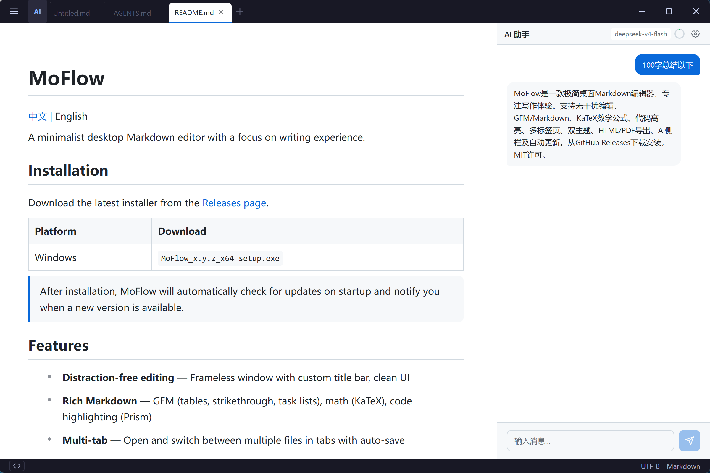

  

<h1 align="center">MoFlow</h1>

A minimalist desktop Markdown editor with a focus on writing experience.

  <a href="./README.zh-CN.md">中文</a> | English

## Installation

Download the latest installer from the [Releases page](https://github.com/xmm1989218/moflow/releases/latest).

| Platform | Download |
|---|---|
| Windows | `MoFlow_x.y.z_x64-setup.exe` |

> After installation, MoFlow will automatically check for updates on startup and notify you when a new version is available.

## Features

- **Distraction-free editing** — Frameless window with custom title bar, clean UI
- **Rich Markdown** — GFM (tables, strikethrough, task lists), math (KaTeX), code highlighting (Prism), highlight (`==text==`)
  See [Markdown syntax support](./tests/markdown-support.md) for full details
- **Multi-tab** — Open and switch between multiple files with instant tab switching, auto-save, and preserved scroll/cursor/undo per tab
- **Dual theme** — Light and dark themes with smooth switching
- **Export** — HTML and PDF export
- **AI Sidebar** — Integrated AI chat with context management, auto-compact, and usage tracking
- **AI Tool-Calling** — AI can actively explore documents via tools (outline, grep, read_lines, read_section) and fetch web content instead of relying on truncated context
- **Context View** — Inspect token usage, context breakdown, and raw messages in a dedicated panel
- **Selection AI** — Explain, translate, or ask questions about selected text
- **Settings Tab** — Unified settings panel with appearance, AI config, proxy, and about sections
- **Proxy Support** — HTTP/HTTPS/SOCKS5 proxy for AI requests and web content fetching
- **Find & Replace** — Regex support, case-sensitive search, replace all
- **Auto Update** — Silent check on startup, background download, non-intrusive notification with one-click install & restart
- **Status bar** — Word count, cursor position, file info at a glance

## Contributing

If you'd like to contribute to MoFlow, please read the [Contributing Guide](./CONTRIBUTING.md) for setup instructions, project structure, and release process.

## License

MIT
