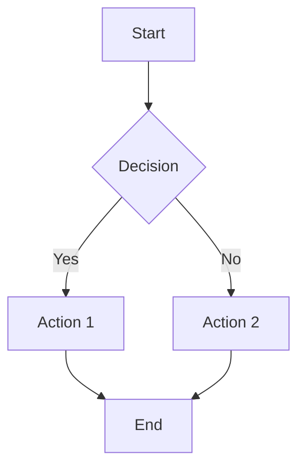
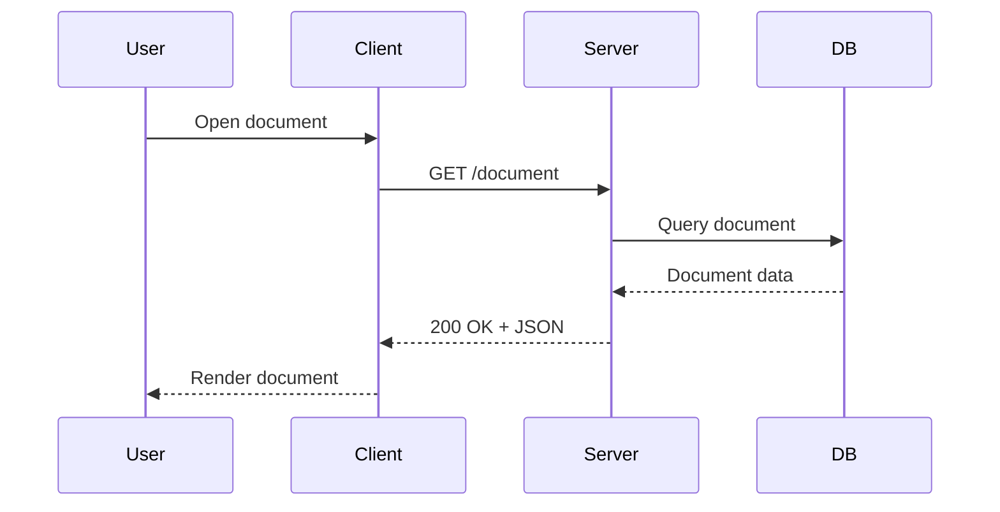
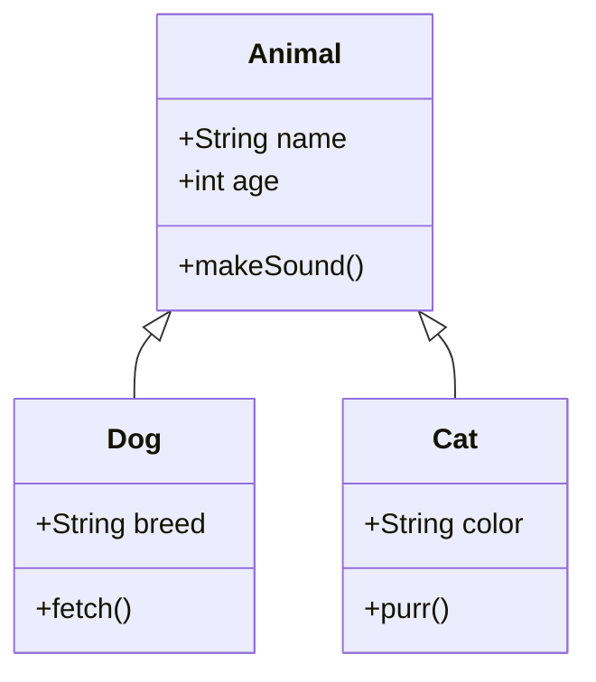
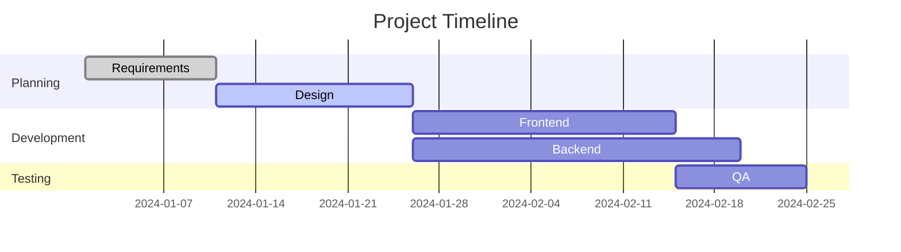
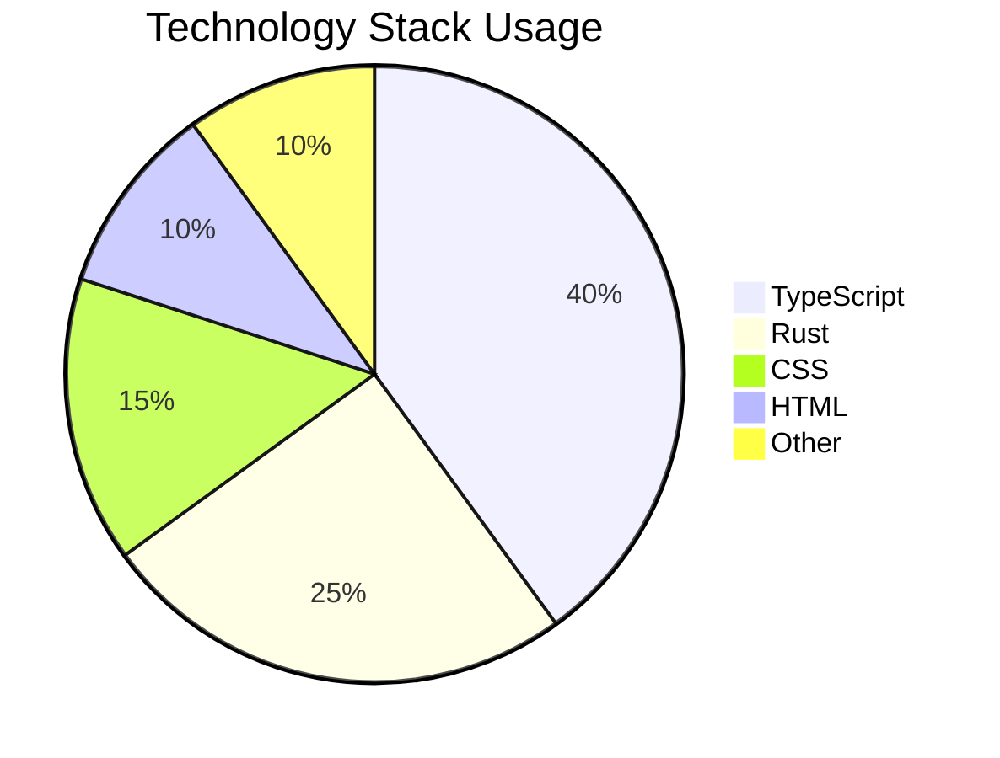
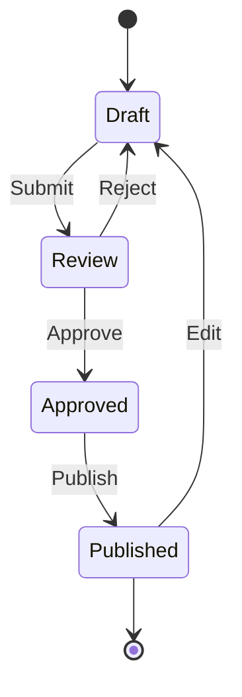

# Markdown Specification Test Suite

> Based on: Markdown 1.0, CommonMark 0.31, GitHub Flavored Markdown 0.29, MoFlow Custom Extensions

---

## 1. Markdown 1.0

### 1.1 Backslash Escapes

These should render as literal characters, not Markdown syntax:

\*not italic\*
\_not italic\_
\#not a heading
\[not a link\](url)
\\`not code\\`
\~\~not strikethrough\~\~
\==not highlight\==

### 1.2 Auto Links (Markdown 1.0 style)

<https://example.com>
<user@example.com>

### 1.3 Amps and Angles Encoding

AT&T should render as AT&T
&lt;script&gt; should render as &lt;script&gt;
&copy; should render as &copy;

### 1.4 Blockquotes with Code Blocks

> A blockquote with a code block:
>
>     code in blockquote
>     indented 4 spaces

### 1.5 Code Blocks (Indented)

    This is an indented code block.
    It should preserve whitespace.
    
        Nested indentation in code block.

### 1.6 Code Spans (Inline)

Use `console.log()` to debug.
Code span with backtick: `` `escaped backtick` ``
Multiple `inline` code `spans` in one line.

### 1.7 Hard-Wrapped Paragraphs with List-Like Lines

This is a paragraph that
is hard-wrapped with two trailing spaces  
which should produce a line break.

1986. What a great season. (This should NOT be a list item.)

### 1.8 Horizontal Rules

---

* * *

___

- - -

***

### 1.9 Inline HTML - Simple

This is <em>inline HTML</em> in a paragraph.
This is <strong>also inline HTML</strong>.

### 1.10 Inline HTML - Advanced

<div>
This is a block-level HTML element.
</div>

### 1.11 Inline HTML - Comments

<!-- This is an HTML comment and should not be visible -->

Text before comment <!-- inline comment --> text after comment.

### 1.12 Links - Inline Style

[inline link](https://example.com)
[inline link with title](https://example.com "Example Title")
[inline link with parentheses](https://example.com/path?q=(foo))

### 1.13 Links - Reference Style

[reference link][ref1]
[reference link with colon][ref2]
[reference link - shortcut]

[ref1]: https://example.com
[ref2]: https://example.com "Reference Title"
[reference link - shortcut]: https://example.com

### 1.14 Links - Shortcut References

[Google]
[Yahoo]

[Google]: https://google.com
[Yahoo]: https://yahoo.com

### 1.15 Literal Quotes in Titles

[link with "quotes"](https://example.com "Title with \"quotes\"")

### 1.16 Nested Blockquotes

> Level 1
>
> > Level 2
> >
> > > Level 3
>
> Back to Level 1

### 1.17 Ordered and Unordered Lists

Unordered:

- Item one
- Item two
- Item three

Ordered:

1. First item
2. Second item
3. Third item

Mixed:

1. Ordered item
   - Nested unordered
   - Another nested
2. Back to ordered

### 1.18 Tabs

Code block with tabs:

	tabs in code block
	more tabs

---

## 2. CommonMark 0.31

### 2.1 ATX Headings

# Heading 1

## Heading 2

### Heading 3

#### Heading 4

##### Heading 5

###### Heading 6

####### Not a heading (7 hashes)

### Heading with trailing hashes ###

### 2.2 Setext Headings

Heading 1
=========

Heading 2
---------

### 2.3 Thematic Breaks

***

---

___

* * *

- - -

_ _ _

*-*-* (not a thematic break)

### 2.4 Indented Code Blocks

    line 1
    line 2
    
    line 3 (after blank line)

### 2.5 Fenced Code Blocks

```
plain fenced code block
```

```javascript
const greeting = "hello";
console.log(greeting);
```

```python
def hello():
    print("world")
```

~~~
tilde fence also works
~~~

````nested fences - four backticks
```code inside
```
````

### 2.6 HTML Blocks

<div>
This is an HTML block.
</div>

<table>
  <tr><td>Cell</td></tr>
</table>

<!-- HTML comment block -->

### 2.7 Link Reference Definitions

[link definition 1][def1]
[link definition 2][def2]
[link definition 3][def3]

[def1]: https://example.com/1
[def2]: https://example.com/2 "Title 2"
[def3]: https://example.com/3 'Title 3'

### 2.8 Paragraphs

This is a paragraph.

This is another paragraph.
This is the same paragraph (no blank line).

### 2.9 Blank Lines

Paragraph above blank line.

(blank lines between)

Paragraph below blank line.

### 2.10 Block Quotes

> Simple blockquote
> Multiple lines
> In one blockquote

> Blockquote with **bold** and *italic*

> Blockquote with list:
> 1. Item 1
> 2. Item 2

> Paragraph 1
>
> Paragraph 2 in same blockquote

Lazy continuation:

> This is a blockquote
lazy continuation line

### 2.11 List Items

- unordered item 1
- unordered item 2
- unordered item 3

1. ordered item 1
2. ordered item 2
3. ordered item 3

- item with paragraph

  second paragraph in list item

- item with code block

      code in list item

### 2.12 Lists (Tight vs Loose)

Tight list:
- one
- two
- three

Loose list:

- one

- two

- three

### 2.13 Emphasis and Strong Emphasis

*single asterisks for italic*
_single underscores for italic_

**double asterisks for bold**
__double underscores for bold__

***triple asterisks for bold italic***
___triple underscores for bold italic___

*italic **bold inside italic** italic*
**bold *italic inside bold* bold**

*italic *nested italic* italic*

Intra-word: fan*tas*tic
Intra-word: fan**tas**tic

foo**bar**baz
foo*bar*baz

### 2.14 Code Spans

`simple code span`
`code span with <html> entity`
`code span with backslash \\`
``code span with single backtick ` inside``
`code span with   multiple   spaces  collapsed`

### 2.15 Links

[link](https://example.com)
[link with title](https://example.com "Title")
[link with spaces](https://example.com/path%20with%20spaces)
[link with angle brackets](<https://example.com>)

### 2.16 Images


### 2.17 Autolinks (CommonMark)

<https://example.com>
<user@example.com>

### 2.18 Raw HTML

<b>Bold via HTML</b>
<i>Italic via HTML</i>
<span style="color:red">Red text via HTML</span>

### 2.19 Hard Line Breaks

Line with two trailing spaces  
Next line (should be a hard break)

Line with backslash\
Next line (should be a hard break)

### 2.20 Soft Line Breaks

This line
and this line
should be a soft break (single newline in source).

### 2.21 Entity and Numeric Character References

&amp; renders as &
&lt; renders as <
&gt; renders as >
&#39; renders as '
&#x1F600; renders as 😀
&copy; renders as ©
&ndash; renders as –

### 2.22 Precedence

**`code in bold`**
*`code in italic`*
[`link with code`](https://example.com)

---

## 3. GitHub Flavored Markdown 0.29

### 3.1 Tables

| Header 1 | Header 2 | Header 3 |
|----------|----------|----------|
| Cell 1   | Cell 2   | Cell 3   |
| Cell 4   | Cell 5   | Cell 6   |

Table with alignment:

| Left | Center | Right |
|:-----|:------:|------:|
| L1   | C1     | R1    |
| L2   | C2     | R2    |

Table without leading pipe:

Header 1 | Header 2 | Header 3
---|---|---
A | B | C

Table with inline formatting:

| Style | Syntax |
|-------|--------|
| **Bold** | `**text**` |
| *Italic* | `*text*` |
| ~~Strikethrough~~ | `~~text~~` |

### 3.2 Task List Items

- [x] Completed task
- [ ] Incomplete task
- [x] Another completed task
- [ ] Another incomplete task

Nested task list:

- [x] Parent task
  - [x] Sub-task completed
  - [ ] Sub-task incomplete
- [ ] Another parent

### 3.3 Strikethrough

~~strikethrough text~~
~~strikethrough with **bold inside**~~
~~strikethrough with *italic inside*~~

### 3.4 Autolinks (GFM Extension)

URL autolinks without angle brackets:
https://example.com
www.example.com

Email autolink:
user@example.com

URL with path:
https://example.com/path/to/page?query=value&other=123

---

## 4. MoFlow Custom Extensions

### 4.1 Highlight (`==text==`)

==highlighted text==
==highlight with **bold inside**==
==highlight with *italic inside**==
==highlight with ~~strikethrough inside~~==
==highlight with `code inside`==

Combined: **bold ==highlight inside bold== bold**

### 4.2 Inline Math

$E = mc^2$
$a^2 + b^2 = c^2$
$\sum_{i=1}^{n} i = \frac{n(n+1)}{2}$
$\alpha, \beta, \gamma$
$f(x) = \int_{-\infty}^{\infty} e^{-x^2} dx$

### 4.3 Block Math

$$
E = mc^2
$$

$$
\int_0^\infty e^{-x^2} dx = \frac{\sqrt{\pi}}{2}
$$

$$
\begin{pmatrix}
a & b \\
c & d
\end{pmatrix}
$$

---

## 5. Edge Cases and Mixed Syntax

### 5.1 Nested Formatting

***bold and italic with ~~strikethrough~~***
**bold with *italic* and ==highlight==**
~~strikethrough with *italic* and `code`~~

### 5.2 Code Block in List

1. First item with code:

   ```javascript
   const x = 1;
   ```

2. Second item

### 5.3 Table in Blockquote

> | A | B |
> |---|---|
> | 1 | 2 |
> | 3 | 4 |

### 5.4 Nested Blockquote with Lists

> - List in blockquote
>   - Nested item
> - Another item
>
> > Nested blockquote with `code`

### 5.5 Math with Special Characters

Price is $\$100$ dollars.
Not math: 100$ and 50$
Inline math with braces: $\{x \in \mathbb{R} : x > 0\}$

### 5.6 Mixed Emphasis Boundaries

*italic*text* (should not be italic across boundary)
**bold**text** (should not be bold across boundary)
foo*bar*baz (should be italic for bar)
foo**bar**baz (should be bold for bar)

### 5.7 Links and Images Combined

[](https://example.com)

### 5.8 Escape in Various Contexts

- \*escaped in list
- \[escaped bracket\]
> \*escaped in blockquote\*

### 5.9 Empty Elements


[link with no url]()

### 5.10 Unicode and Special Characters

Unicode text: 中文 日本語 한국어
Emoji: 🎉 🚀 ✅
Special dashes: em—dash, en–dash
Ellipsis…

### 5.11 Deeply Nested Lists

- Level 1
  - Level 2
    - Level 3
      - Level 4
        - Level 5
  - Back to Level 2
- Back to Level 1

### 5.12 HTML in Markdown

<div markdown="1">

This **should** be parsed as Markdown inside HTML.

</div>

---

## 6. Mermaid Diagrams

> Mermaid code blocks should render an SVG preview below the code editor.
> Click the preview toggle to switch between source editing and rendered view.
> Dark/light theme should match the editor theme.

### 6.1 Flowchart

Should render a top-down flowchart with diamond decision node and rectangular action nodes:



### 6.2 Sequence Diagram

Should render a sequence diagram with 4 participant lifelines and message arrows:



### 6.3 Class Diagram

Should render a UML class diagram with inheritance arrows:



### 6.4 Gantt Chart

Should render a Gantt chart with colored task bars and section labels:



### 6.5 Pie Chart

Should render a circular pie chart with labeled slices and percentages:



### 6.6 State Diagram

Should render a state machine with transitions and start/end nodes:



### 6.7 Mermaid with Error (Invalid Syntax)

Should display an error message instead of a rendered diagram:

```mermaid
graph BROKEN
    A ->>
```
